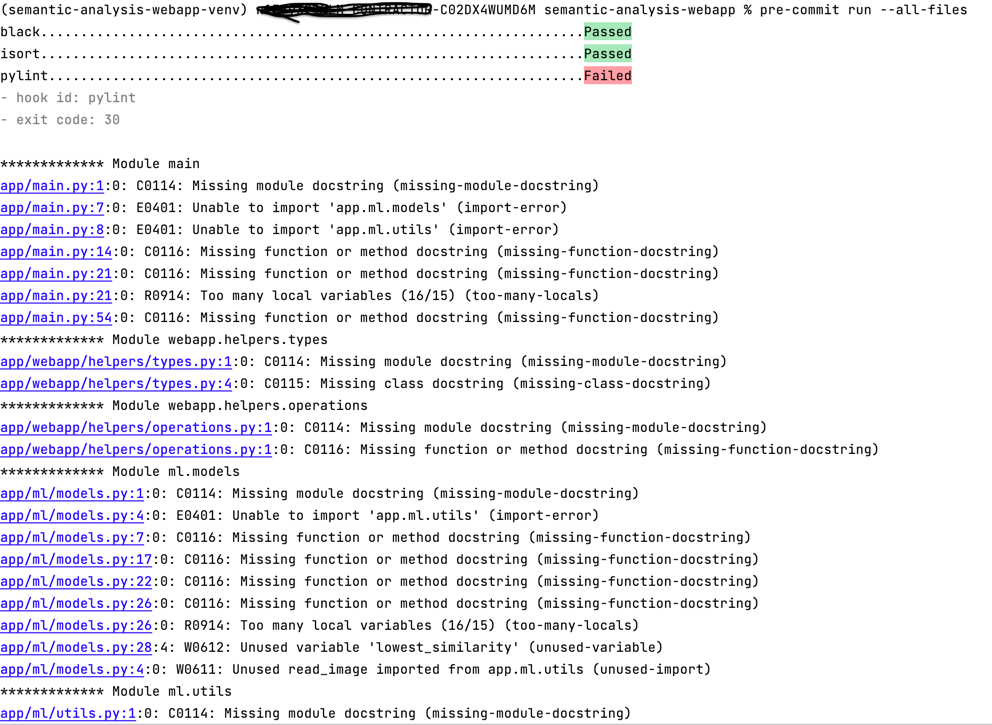
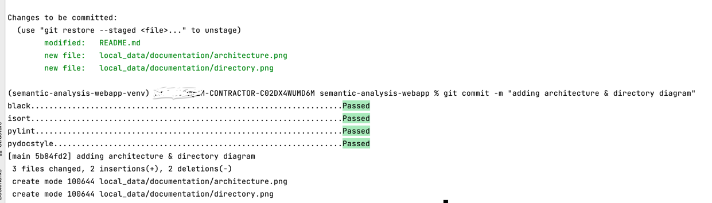

# Steps to contribute in the project!

This file enlist the process of adding any feature or modifications to the existing project 
## Steps:
- Make sure you have read the [Readme](README.md) file and understand how the project works
- Add any modification or feature the existing project
- Make sure you have added enough [unit tests](tests) justifying the reliability of your work
- Once you are ready commit. Run `pre-commit run --all-files` from your terminal
- If you fail any of the pre-commits, address them to make upto the coding standards 
- Once all pre-commits pass, you can push your changes to git 