# Semantic Analysis
This project demonstrates semantic analysis of images using webapp. 
The fundamental feature of this project is to provide images as input to the API system where one list of images are referred as input files and one file is referred as reference file. 
The goal is to detect which image file amongst the list of input images is semantically very close to the reference image.

## Architecture Diagram

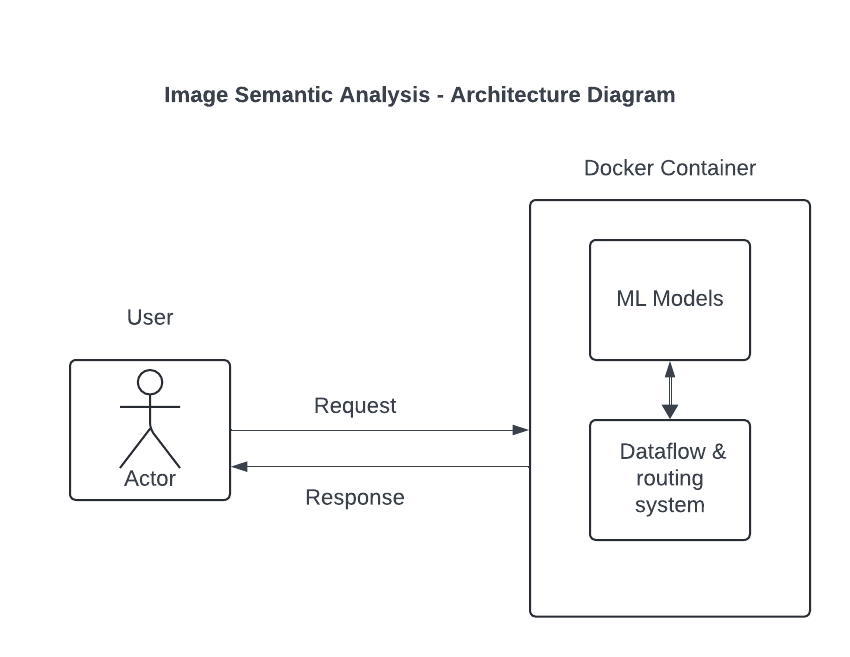

## Directory Diagram

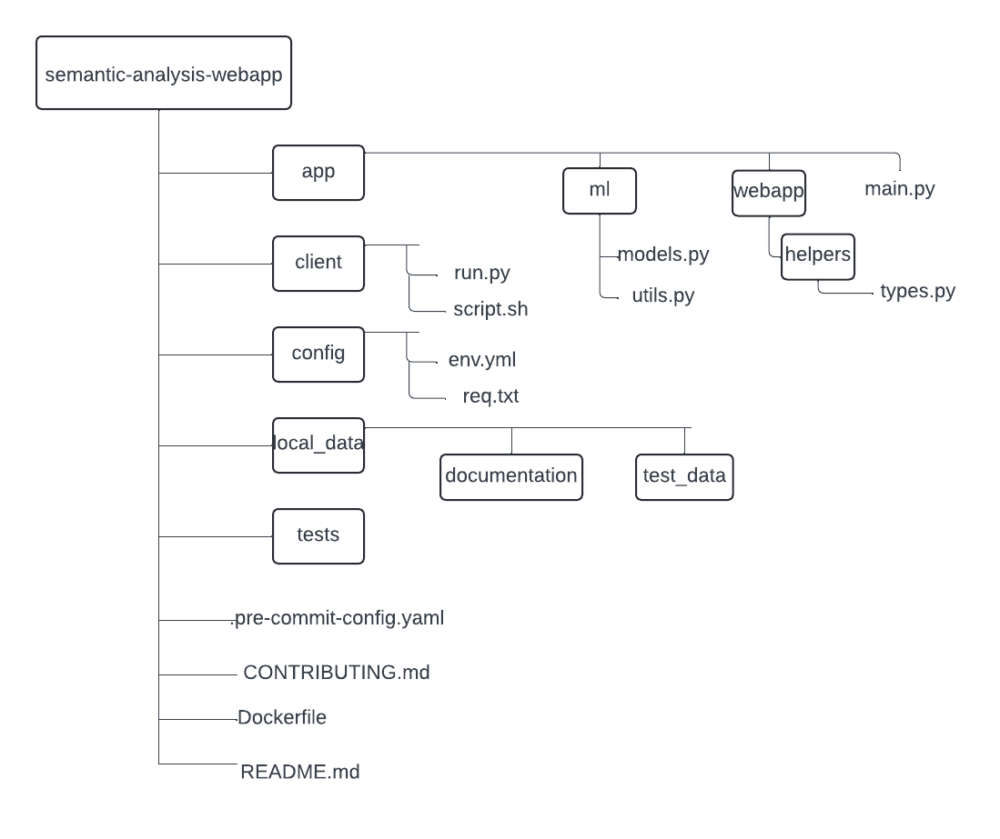

## Tech Stack
- [Python 3.9](https://www.python.org/downloads/release/python-390/) - To implement the features on this project 
- [FastApi](https://fastapi.tiangolo.com/) - To build the web APIs
- [Docker](https://www.docker.com/) - To containerize the built web application
- [Tensorflow](https://www.tensorflow.org/api_docs/python/tf/keras/applications/VGG16) - Pretrained VGG16 image model is used to and embeddings
- [PyTorch](https://pytorch.org/vision/stable/models.html) - Pretrained ResNet50 image model is used to predict image category and get the embeddings
- [Sklearn](https://scikit-learn.org/stable/modules/generated/sklearn.metrics.pairwise.cosine_similarity.html) - To compare produced image embeddings and produce cosine similarity

## How to run this project?

### Local (using Swagger UI)
1. Clone [this](https://github.com/thakareakshay1709/semantic-analysis-webapp.git) repository from github
2. Create the virtual environment from `config/environment.yml`
   1. Go to the root directory you can run `conda env create -f config/environment.yml` from the terminal
   2. You can verify if the virtual environment is created successfully if you see this in your terminal 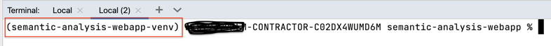
3. This environment should be able to install all packages provided in [requirements.txt](config/requirements.txt)
4. You can also use any traditional way to create the virtual environment unless you are installing packages provided.
5. Next step is to invoke FastApi's uvicorn server from your terminal by running `uvicorn app.main:webapp --reload` and verify in the terminal that application is started 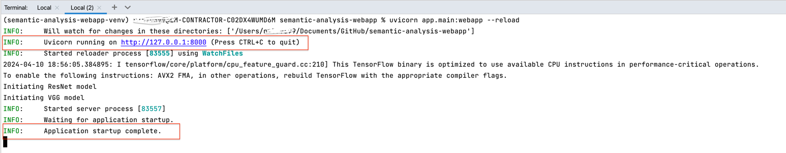
6. Clicking on the link should open up the installed browser with the message below 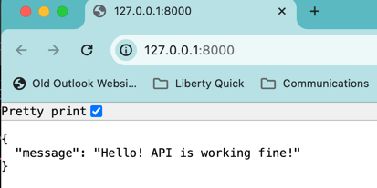
7. Appending `/doc` to above endpoint will open up FastApi's Swagger UI which will list all endpoints 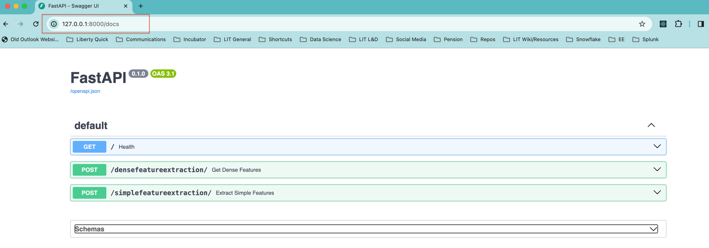
8. Now you can start exploring each of them -
   1. Click the dropdown from one of the POST method and click **Try Out** button on right part of screen.
   2. Now you can input list of images by **Add string Item** and remove inputs by clicking **-** button against it. Also, select one image file for **ref_file** input. 
   3. Test data is provided in [test_data](local_data/test_data) directory which includes images of cat (c1.png) and dog (d1.png)
   4. Once you have provided the input hit **Execute** button 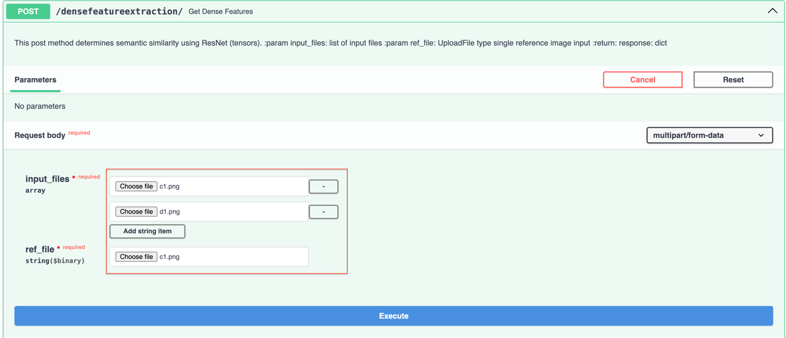
   5. Response should follow stating the closest semantic similarity of input images with reference image 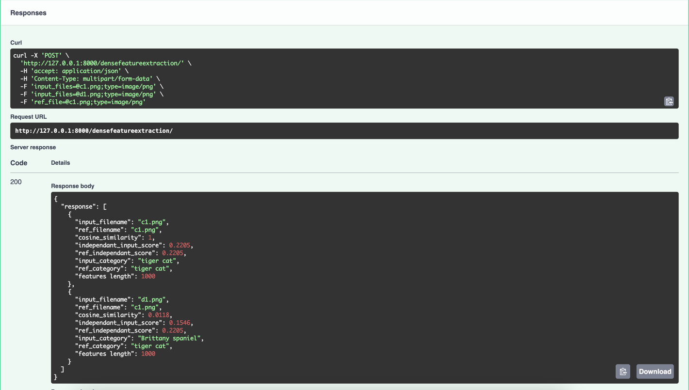
   6. Response is list of dictionaries called records having following attributes
      1. **input_filename** - name of the input file provided
      2. **ref_filename** - name of reference file provided
      3. **cosine_similarity** - float number representing semantic similarity 0 (least similar) - 1 (most similar)
      4. **input_category** - category determined by pretrained image model for input image
      5. **ref_category** - category determined by pretrained image model for reference image
      6. **independant_input_score** - float number representing confidence of pretrained image model determining input_category
      7. **ref_independant_score** - float number representing confidence of pretrained image model determining input_category
      8. **features length** - number of extracted embeddings
9. Similarly you can follow the same steps for other endpoint

### Local (using Postman)
1. Follow the same steps until step 6 in [Local (using Swagger UI)](#local-using-swagger-ui) section
2. Open [postman tool](https://www.postman.com/) -> create blank collection -> Add post request (http://127.0.0.1:8000/simplefeatureextraction/)
3. Select form-data as datatype and fillout details as below 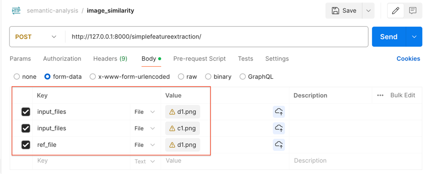
4. Response should follow stating the closest semantic similarity of input images with reference image 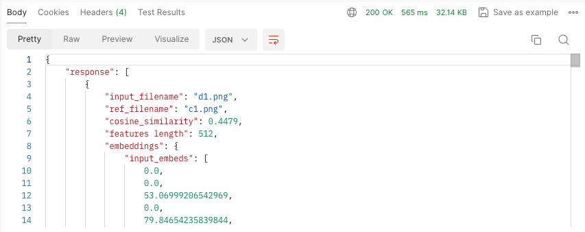
5. Response is list of dictionaries called records having following attributes
   1. **input_filename** - name of the input file provided
   2. **ref_filename** - name of reference file provided
   3. **cosine_similarity** - float number representing semantic similarity 0 (least similar) - 1 (most similar)
   4. **features length** - number of extracted embeddings

### Command Line - Client Side (using Docker)
1. Clone [this](https://github.com/thakareakshay1709/semantic-analysis-webapp.git) repository from github
2. Make sure you have [docker](https://www.docker.com/) installed and running locally
3. Make sure you have stopped all local instances of uvicorn server (Press CTRL+C from terminal)
4. To build the docker image, run `docker build -t myimage .` & to run the image in docker container run `docker run -d --name mycontainer -p 80:80 myimage` 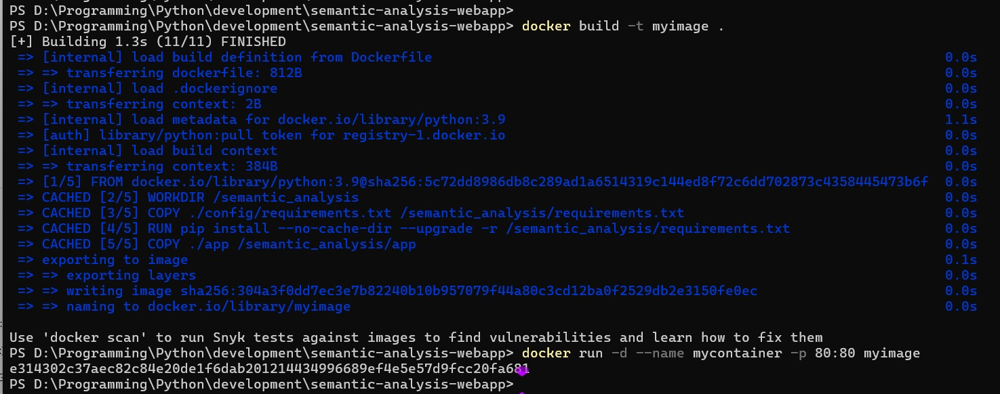
5. Make sure your docker image built in [docker desktop](https://www.docker.com/products/docker-desktop/) sucessfully and running 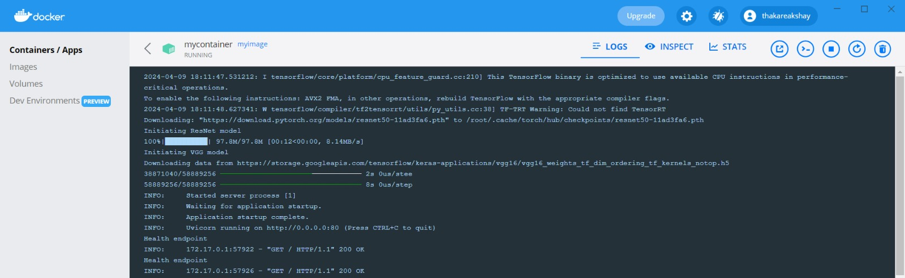
6. Now open an application which runs the bash script. I have used [git bash](https://git-scm.com/downloads)
7. Navigate to repository's path `cd /your/path/semantic-analysis-webapp`
8. Endpoints use hardcoded [test data](local_data/test_data) to prepare [client payload](client/run.py) in `prepare_local_payload` function.
9. Run `./client/script.sh`
   1. From command line, you will be notified by message that *Endpoint is working*
   2. User Input - you will be prompted to enter one of the values from (simple or dense)
   3. When you type **dense** and hit enter 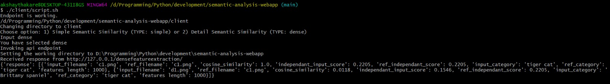 (invokes http://127.0.0.1:8000/densefeatureextraction/)
   4. When you type **simple** and hit enter 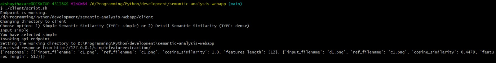 (invokes http://127.0.0.1:8000/simplefeatureextraction/)
   5. When you enter invalid option 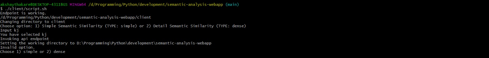
10. Congratulations! You have executed both endpoints mentioned in above steps using CLI

## How to contribute to this project?

To develop this project further follow the steps provided in [CONTRIBUTING.md](CONTRIBUTING.md).

## Limitations
While developing this application I realised following limitations

1. This application only tested on Mac so lack testing across platforms
2. Very limited unit tests - could not follow test driven due to time constraints
3. Tested on limited data
4. Memory spikes could be high when provided large & numerous images as input

## Future Scope

1. Use Poetry to manage python packages efficiently
2. Broader error handling and input validation
3. Enforce more test coverage - 80% in [precommit-hooks](.pre-commit-config.yaml)
4. Load testing or performance testing
5. Better logging
6. Fine tuning pretrained models for better accuracy
7. Better architecture (dataclasses etc)